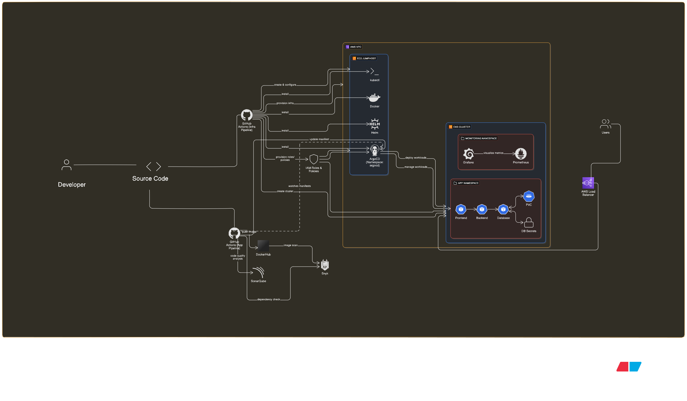

# Automated Secure Application Delivery with GitHub Actions, Terraform, ArgoCD, and Kubernetes

## 📌 Overview

This project demonstrates a DevSecOps workflow for securely deploying a cloud-native application on AWS EKS. It integrates infrastructure automation, CI/CD pipelines, security scanning, and GitOps deployment for an end-to-end solution.

## 🏗️ Architecture

The architecture consists of the following components:

### GitHub Actions Pipelines
- Terraform Workflow (separate repository): Provisions AWS infrastructure (EKS, EC2, VPC, LoadBalancer, IAM, Security Groups) and installs required tools on an EC2 instance.
- Application Workflow: Handles application lifecycle including
- Code Quality Analysis (SonarQube)
- Dependency Scanning 
- Docker Image Build & Push (DockerHub)
- Image Security Scan (Snyk)
- Deployment Manifest Update (with the new image tag)

### ArgoCD on EC2
- Implements GitOps by continuously syncing updated Kubernetes manifests from GitHub to the EKS cluster.
- Automates application deployment and rollback.
- EKS Cluster Workloads
- Frontend Pods → serve UI
- Backend Pods → handle business logic
- Database Pods → persistent data layer
- Connected to PVCs for storage
- DB Secrets for secure credentials
- Services are exposed via a LoadBalancer for user access.

### Monitoring & Observability
- Prometheus → Metrics collection
- Grafana → Visualization dashboards

## ⚙️ Workflow Summary

Code Commit (GitHub) → triggers CI/CD pipeline.
Terraform Pipeline → sets up AWS infra and tools.
Application Pipeline → scans code, builds Docker image, scans vulnerabilities, updates manifests.
ArgoCD → deploys application to EKS cluster automatically.
Monitoring Tools → ensure observability and performance tracking.

## 🚀 Key Highlights
Fully automated DevSecOps pipeline integrating CI/CD, IaC, security scanning, and GitOps.
Scalable & Secure cloud-native deployment on AWS EKS.
Continuous Monitoring with Prometheus & Grafana.
Implements best practices in container security and infrastructure management.
